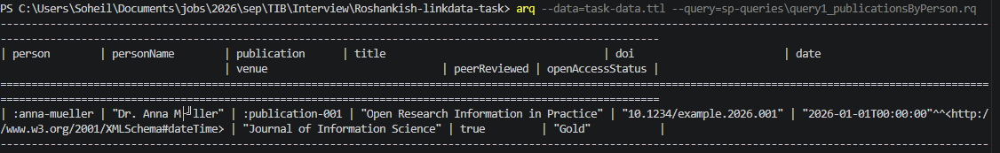
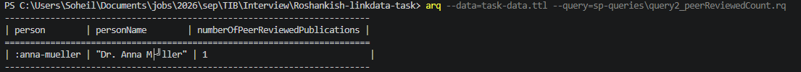
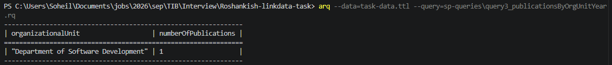

# Modelling Research Information with RDF

In this project, I modelled the provided research information in RDF using VIVO and also considered KDSF 2.1 where relevant.
The provided research information is represented in Turtle. SPARQL queries are used to retrieve publication metadata and perform the required aggregations over the RDF graph.

## Development Environment

The project was developed and tested using the following environment:

- Visual Studio Code: 1.139.1
- Protégé: 5.6.9
- Java: 27
- Apache Jena: 6.2.0
- Operating System: Windows 11 (64-bit)

## Project Structure

The project is organised as follows:

```text
Roshankish-linkdata-task/
├── README.md
├── LICENSE
├── task-data.ttl
├── vivo.owl
├── sp-queries/
│   ├── query1_publicationsByPerson.rq
│   ├── query2_peerReviewedCount.rq
│   └── query3_publicationsByOrgUnitYear.rq
└── screenshots/
    ├── query1Result.png
    ├── query2Result.png
    └── query3Result.png
```
## Modelling Approach


I first loaded `vivo.owl` in Protégé and checked which VIVO classes and properties could be used for the given data. I also checked the domains, ranges and descriptions of the properties before using them.

For the main entities I used `foaf:Person`, `foaf:Organization`, `vivo:AcademicDepartment`, `bibo:Article` and `bibo:Journal`.

For the relationships, I used `vivo:Authorship` to connect Anna Müller with the publication and `vivo:Position` to connect her with the department. The department is connected to the university with the BFO `part of` property (`BFO_0000050`).

I could not find suitable VIVO properties for representing the given peer-reviewed and Open Access values directly. I therefore added the two local properties :peerReviewed and :openAccessStatus. I also compared these properties with the corresponding concepts in KDSF, as described below.

## KDSF Consideration

I also looked at KDSF to see whether I could use existing properties instead of the two local ones.

For Peer-Reviewed, I found the KDSF data property `ist Peer Reviewed` with the IRI `http://kerndatensatz-forschung.de/owl/Basis#PeerReviewed`. It has `Publikation` as its domain and `xsd:boolean` as its range. However, this property comes from the older KDSF OWL representation, while I used KDSF 2.1 as the current reference for this task. To avoid mixing different KDSF versions, I kept the local property `:peerReviewed`.

I also checked `Zugangsrechte` (`http://kerndatensatz-forschung.de/owl/Basis#Zugangsrechte`), which has `Publikation` as its domain and `xsd:string` as its range. KDSF 2.1 refers to the COAR Access Rights Vocabulary for access rights. Since `"Gold"` in the provided data describes the Open Access publishing route rather than just the access right, I kept `:openAccessStatus` as a local property.

So, although I did not use the KDSF properties directly in the RDF model, I checked the corresponding KDSF concepts before deciding to use the local properties.

## Publication Date

The task provides the publication year (`2026`) but no exact publication date. VIVO represents dates using `vivo:DateTimeValue` and `vivo:dateTime`, with the latter using `xsd:dateTime`.

For this small dataset, `2026-01-01T00:00:00` is therefore used as a technical representation that enables year-based SPARQL queries. It should not be interpreted as an assertion that the publication was actually published on 1 January 2026.

## SPARQL Queries

Three SPARQL queries were implemented to answer the questions defined in the task.

### Query 1 – Publications by Person

`query1_publicationsByPerson.rq`

Retrieves the publications associated with a specific person through `vivo:Authorship`. The query returns relevant publication metadata including the title, DOI, publication date, publication venue, peer-review status, and Open Access status.

### Query 2 – Peer-Reviewed Publications by Venue

`query2_peerReviewedCount.rq`

Counts the distinct peer-reviewed publications authored by a specific person and published in a specified publication venue. The query combines the `vivo:Authorship` relationship with the publication's peer-review status and `vivo:hasPublicationVenue`.

### Query 3 – Publications by Organisational Unit and Year

`query3_publicationsByOrgUnitYear.rq`

Counts the number of distinct publications associated with each organisational unit for a specified year. The query connects publications to their authors through `vivo:Authorship` and connects the authors to their organisational units through `vivo:Position`. The publication year is evaluated using the VIVO date-time value.

## Running and Testing

The RDF model and all SPARQL queries were tested using Apache Jena ARQ (version 6.2.0).

From the project root directory, the queries can be executed with:

```powershell
arq --data=task-data.ttl --query=sp-queries\query1_publicationsByPerson.rq
```
### Query 1 – Example Result



```powershell
arq --data=task-data.ttl --query=sp-queries\query2_peerReviewedCount.rq
```
### Query 2 – Example Result



```powershell
arq --data=task-data.ttl --query=sp-queries\query3_publicationsByOrgUnitYear.rq
```
### Query 3 – Example Result



The queries were executed successfully against the Turtle dataset. For the provided example data, Query 1 returns Anna Müller's publication with its metadata, Query 2 finds one peer-reviewed publication, and Query 3 counts one publication for the Department of Software Development in 2026.